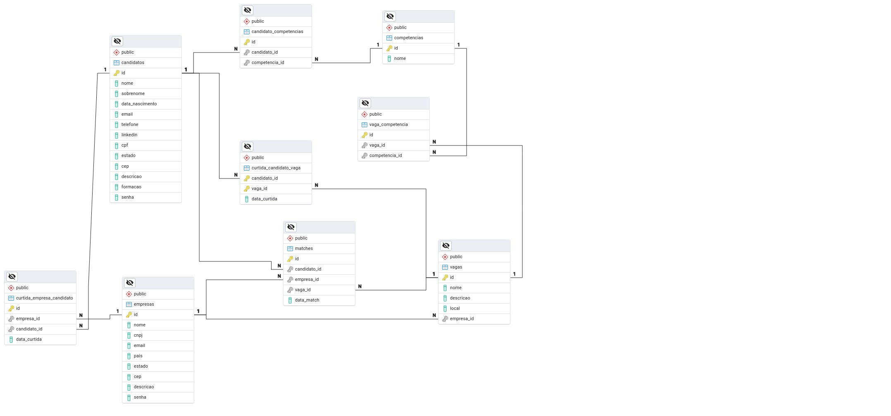

# LinkeTinder (FRONTEND) - Autor: Daniel Costa - ACZG 6.0

Linketinder é uma aplicação Groovy que permite a interação entre candidatos e empresas, e promete revolucionar o método como são realizadas as contratações de novos colaboradores, esta aplicação está sendo desenvolvida como um dos projetos do ACZG 6.0.

## Modelagem de Dados e SQL

Clique para ler a Documentação

## Tecnologias Utilizadas

- **POSTGRESQL**: Banco de dados utilizado para comportar os dados (Versão: 17.0)
- **PGADMIN**: SGBD (Sistema de gerenciamento de Banco de dados do Postgres). Utilizei principalmente para elaboração do Diagrama de Entidade e Relacionamento, e para execução dos scripts SQL

# Modelagem de Dados Linketinder

A partir dessa estrutura e da implementação em código, o sistema será capaz de permitir que empresas publiquem vagas, candidatos possam curtir essas vagas e empresas possam curtir candidatos diretamente. Segue abaixo uma explicação de cada entidade e suas relações.

## Entidades Principais
**Candidatos (candidatos)**

Armazena as informações pessoais dos candidatos, como nome, sobrenome, email, telefone, CPF, formação e uma breve descrição.
Os candidatos podem curtir vagas específicas, mas não podem curtir empresas diretamente.

**Empresas (empresas)**

Armazena as informações das empresas, como nome, CNPJ, email, endereço e uma descrição.
As empresas podem curtir diretamente os perfis de candidatos, demonstrando interesse.

**Vagas (vagas)**

Representa as oportunidades de emprego criadas pelas empresas, com detalhes como nome da vaga, descrição e local.
Os candidatos podem curtir as vagas, e essa interação é armazenada na tabela de curtidas.

## Relacionamentos

**Candidatos - Competências (candidato_competencias)**

Relação de muitos para muitos (N) entre candidatos e competências. Cada candidato pode ter várias competências, e uma competência pode ser compartilhada por vários candidatos.

**Vagas - Competências (vaga_competencia)**

Relação de muitos para muitos (N) entre vagas e competências. Cada vaga pode requerer várias competências, e uma competência pode ser exigida por várias vagas.

**Curtidas de Candidatos em Vagas (curtida_candidato_vaga)**

Relaciona candidatos e vagas em uma relação de muitos para muitos (N).
Armazena as curtidas feitas por candidatos em vagas específicas, sem qualquer interação direta com as empresas.

**Curtidas de Empresas em Candidatos (curtida_empresa_candidato)**

Relaciona empresas e candidatos em uma relação de muitos para muitos (N).
As empresas podem visualizar e curtir os candidatos diretamente, demonstrando interesse por perfis específicos.

**Matches (matches)**

Armazena os matches entre empresas e candidatos, quando ambos demonstram interesse.
Um match ocorre quando um candidato curte uma vaga e a empresa responsável pela vaga curte o candidato.

## Fluxo de Curtidas

**Candidatos curtem vagas:** Os candidatos não interagem diretamente com as empresas. Eles podem curtir apenas as vagas publicadas pelas empresas.

**Empresas curtem candidatos:** As empresas têm a capacidade de curtir diretamente o perfil dos candidatos, sem a necessidade de uma interação inicial por parte do candidato.

## Minhas considerações

Esta modelagem permite uma dinâmica de match semelhante a aplicativos de relacionamento (No caso especificamente o Tinder), onde tanto candidatos quanto empresas podem demonstrar interesse uns nos outros.

A estrutura de curtidas mediada pelas vagas permite que candidatos interajam apenas com as oportunidades de emprego, enquanto as empresas podem interagir diretamente com os perfis de candidatos.

- **Link:** [Clique aqui para baixar o arquivo SQL](https://github.com/danielcostadev/linketinder-frontend/raw/master/linketinder-db.sql)

## Diagrama do Banco de Dados

# Versão TypeScript (FrontEnd) versão atual 2.14.0

## Funcionalidades

- **Adicionar Empresa**: Formulário HTML para cadastro de empresas
- **Adicionar Candidato**: Formulário HTML para cadastro de candidatos
- **Listar Empresas**: Listagem de empresas cadastradas (Disponível apenas para a visão do SUPER USER)
- **Listar Candidatos**: Listagem de candidatos de forma anônima no perfil de cada empresa, exibição de quantidade de candidados por competência em forma de gráfico.
- **Listar Vagas**: Listagem de Vagas disponíveis no perfil de cada candidato, o candidato não consegue visualizar o nome da empresa, apenas das vagas.
- **Validação de Dados**: Validação de entrada de dados dos formulários HTML, a partir da versão 2.14.0 foi implementada a validação com Regex.

## Tecnologias Utilizadas

- **HTML5**: Linguagem de marcação de texto
- **CSS3**: Linguagem de estilização de folhas de estilo em cascata
- **JavaScript**: Linguagem de programação interatividade
- **LOCAL STORAGE**: Armazenamento interno do navegador. (Não é indicado para armazenar dados sensíveis, é apagado ao limpar dados.)
- **VISUAL STUDIO CODE**: Ambiente de Desenvolvimento Integrado (IDE) utilizado.

## Minhas breves considerações

> O projeto LinkeTinder traz consigo uma ideia bastante promissora quando a contração de novos colaboradores, através da "Contratação às cegas" [Funcionalidade que será incluida no decorrer do desenvolimento].
> 
> No desevolvimento desse projeto pude aprimorar ainda mais meus conhecimentos em POO e organização de projeto seguindo os ritos básicos do padrão MVC, também pude melhorar a escrita do código. 
> Com o poder da tipagem do TypeScript o código é revisado e tratando em tempo de desenvolvimento, o que ajuda a prevenir bugs futuros e deixa o código mais organizado, através do Mode Module.
> Nessa nova versão do projeto utilizei o conceito Webpack para o gerenciamento de módulos, separei a lógica e organizei os aquivos seguindo o padrão MVC, esse projeto foi bastante desafiado, pois foi o meu primeiro contato com a linguagem.
> Durante o desenvolvimento aprendi com os erros, e pude adiquirir conhecimento quanto ao modo como a linguagem funciona, e suas particularidades. Como o nome já deixa evidente, TypeScript é bastante exigente quanto a tipagem das funções, atributos.

## COMO FUNCIONA?
### Tela Principal
Na página principal existe um menu principal com links para cadastro de candidatos ou empresas, logo abaixo são exibidas duas imagens representando vagas e candidatos.
- Onde é possível escolher entre encontrar vagas ou candidatos, ao clicar um prompt é aberto solicitnado ao usuário que informe o respectivo ID, nesse momento é feita uma validação para verificar se o ID está associado a alguma empresa ou candidato, se verdadeiro o usuário é redirecionado para o respectivo perfil.
### Cadastrar Candidato/Empresa
- Um formulário é exibido tanto para cadastro de empresas quanto para candidatos, são feitas validações, em caso positivo os dados salvos no localStorage
### Listar Candidatos/Empresas
- Uma lista com informações recuperadas do localStorage é exibida para o respectivo usuário.

## Estrutura do Projeto

### O projeto está organizado da seguinte forma:

- **Controller**: Contém as classes e os métodos responsáveis por gerenciar a manipulação da view e comunicação com a camada Service
- **Service**: Contém as classes responsáveis pela lógica do négócio e realiza chamadas a classe DAO que se comunica com o localStorage
- **Model**: Define as classes principais do domínio, como `Pessoa, Canditado e Empresa`.
- **View(DIST)**: Contém os arquivos HTML, CSS, JS principal.

## Contribuindo

Contribuições são bem-vindas! Sinta-se à vontade para abrir issues e pull requests.

## Licença

- **MIT LICENSE:** [Ver licença](https://github.com/danielcostadev/Linketinder-Project/blob/master/LICENSE)

## Contato

Para maiores informações ou dúvidas, entre em contato:

- **Nome:** Daniel Costa
- **LinkedIn:** [DanielCostaDev](https://www.linkedin.com/in/danielcostadev)
